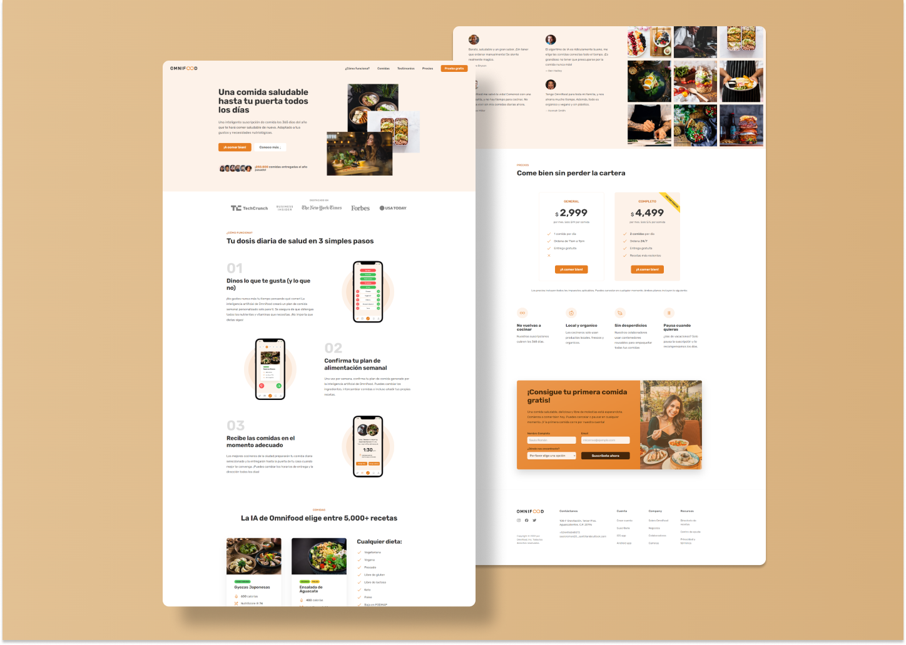

# Omnifood &mdash; LandingPage 🍝


<br />
<br />

Omnifood is a web page to buy some plans to eat better. It was developed to apply and improve my frontend skills into a real project. It has seven sections where you can find information about this start-up, and it's completely responsive.
<br />
<br />

Technologies used: 

  * HTML5
  * CSS3 ( Flexbox and CSS Grid )
  * JavaScript
<br />
<br />

You can check its functionality in: 
```
https://omnifood-srsn.netlify.app/
```
<br />

On the other hand, Javascript was used to add some animation at some sections of the site, to integrate a mobile menu, to make smooth scroll and to apply some css properties in old browsers. So, you don't need a deep expertice of Javascript to understand the code.
<br />
<br />

## UI Considerations

Colors used: 
  * Main color: #E67E22
  * Grays:   
    * Gray 1: #888
    * Gray 2: #767676
    * Gray 3: #6f6f6f
    * Gray 4: #555
    * Gray 5: #333

Breaking Points: 

It's important to mention that this project was developed based on "desktop first" methodology.

  * Phones: 550px 
  * Small tablets: 704px
  * Tablets: 940px
  * Landscape Tablets: 1200px
  * Laptops and Desktop: 1344px

<br />
<br />


